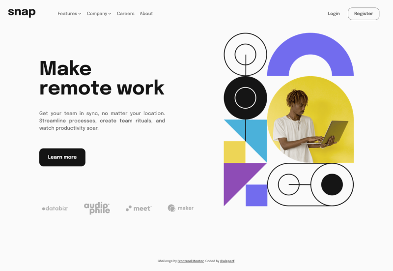
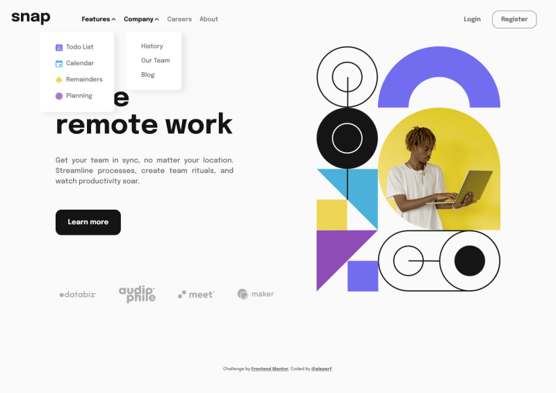
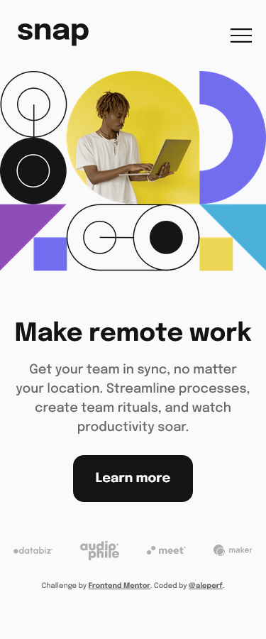
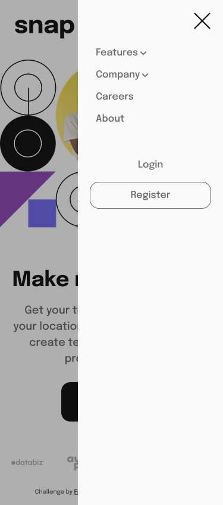
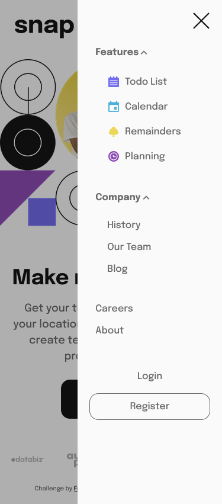

# Frontend Mentor - Intro section with dropdown navigation solution

This is a solution to the [Intro section with dropdown navigation challenge on Frontend Mentor](https://www.frontendmentor.io/challenges/intro-section-with-dropdown-navigation-ryaPetHE5).

## Table of contents

- [Overview](#overview)
  - [The challenge](#the-challenge)
  - [Screenshot](#screenshot)
  - [Links](#links)
- [My process](#my-process)
  - [Built with](#built-with)
  - [What I learned](#what-i-learned)
  - [Useful resources](#useful-resources)
- [Author](#author)

## Overview

### The challenge

The challenge consists in build a landing page for SNAP, a ficitonal company helping other companies organizing remote work.

Users should be able to:

- View the relevant dropdown menus on desktop and mobile when interacting with the navigation links
- View the optimal layout for the content depending on their device's screen size
- See hover states for all interactive elements on the page

Bonus:

The original challenge has only a landing page, I added an About page with the fictional history and future developement at SNAP whose content isn't included in the original challenge because I wanted to use the latest version of [React Router](https://reactrouter.com/) and see how it fits with React. The content of text in the About page is just a figment of my imagination (no real facts, no real people), while the orginal image in the About page is from [Pixabay](https://pixabay.com/it/illustrations/e-commerce-shopping-online-6898102/). All other images used in this project are from [Frontend Mentor](https://www.frontendmentor.io).

### Screenshot

- Desktop version
  

   
   

- Desktop version with opened dropdown menus
  

   
   

- Mobile version, closed sidebar
  

   
   

  - Mobile version, opened sidebar
  

   
   

  - Mobile version, sidebar opened, opened dropdown menus
  

   
   

### Links

- Solution URL: [github code](https://github.com/aleperf/intro-section-with-dropdown-navigation)
- Live Site URL: [dedicated github page](https://aleperf.github.io/intro-section-with-dropdown-navigation/)

## My process

### Built with

- [React](https://reactjs.org/) - JS library
- [React Transition Group](http://reactcommunity.org/react-transition-group/)
- [React Router](https://reactrouter.com/)
- SCSS/SASS
- Flexbox
- Mobile-first workflow

### What I learned

One of the best feature in React is the ability to make developing reusing components quite easy, respect to reusing pure javascript components. This challenge includes a traditional navbar with dropdown menus in the desktop version and a sidebar with similar dropdown menus in the mobile version. I've built a NavMenu component and a Submenu component that can be used in both mobile and desktop, reducing the amount of repetive code.

I've also used React Router DOM to manage a mini-navigation between the Homepage (the original design) and the About page (not included in the original design).

I've used the library React Transition Group, in particular the CSSTranstion component, to implement a slide-in of the sidebar in the mobile version, and to animate the dropdwon menu for mobile and desktop.

### Useful resources

- [React Router Tutorial](https://reactrouter.com/docs/en/v6/getting-started/tutorial)
- [Useful Stackoverflow post](https://stackoverflow.com/questions/54427793/getting-blank-page-after-react-app-publish-in-github) for publishing on Github Pages using React Router

## Author

- My Github - [@aleperf](https://github.com/aleperf)
